# Bharat Agro

# Introduction

Bharat Agro is a cutting-edge cost optimization app designed to empower farmers with essential tools and insights for effective farming. The app helps farmers make informed decisions by providing:
- **Crop Selection Guidance**: Recommendations on the best crops to grow based on local conditions.
- **Fertilizer Usage**: Advice on the optimal fertilizers to use for different crops.
- **Weather Conditions**: Current and forecasted weather data to plan farming activities.
- **Soil Reporting Centers**: Information on nearby soil testing centers to analyze soil quality.

Bharat Agro utilizes Firebase to manage data, featuring two main sections:
- **Admin**: Admins can upload, delete, and manage data within the app.
- **User**: Users can access and read the data provided.

The app also includes:
- **Chart Section**: An interactive chatbot, powered by the Gemini API, that answers users' queries about farming.
- **Profile Section**: A straightforward area where users can view and manage their basic information.

With these features, Bharat Agro aims to streamline farming operations and enhance productivity through comprehensive, data-driven insights.

## Workflow OF this App
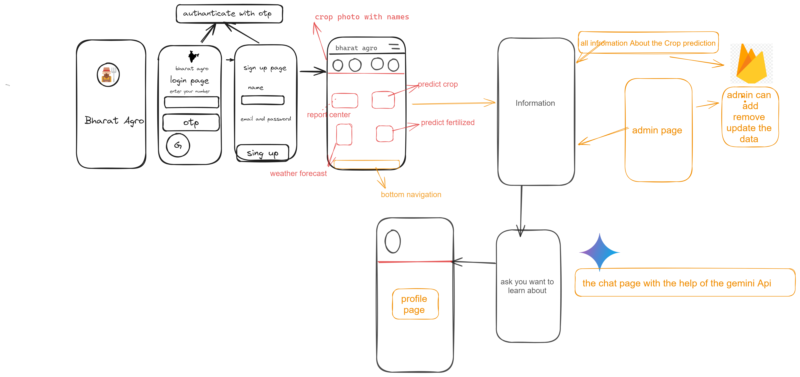

## 🔧 Built with
Technologies used in the project:
- Kotlin
- Xml
- Firebase
- Flask
- MLAlgorithms
- Gemini Api
- Meterial 3 desine
---
## Workflow of Backend and API Documentation
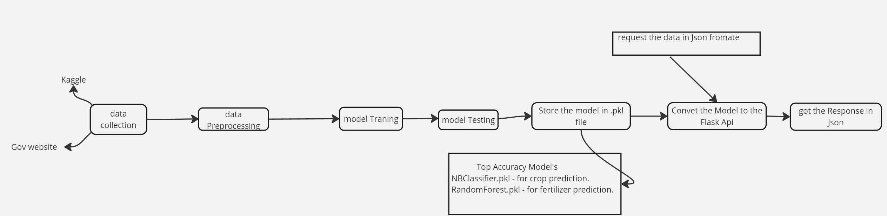
---
## Workflow Explanation
---
1. **Data Collection**
    - Source data from Kaggle and government websites.
    - This data includes various attributes necessary for crop and fertilizer predictions.

2. **Data Preprocessing**
    - Clean and preprocess the collected data.
    - Handle missing values, normalize data, and perform any necessary transformations to make the data suitable for training models.

3. **Model Training**
    - Use the preprocessed data to train machine learning models.
    - Implement different algorithms to find the best-performing models for crop and fertilizer predictions.

4. **Model Testing**
    - Evaluate the trained models using test data.
    - Ensure the models provide accurate predictions and generalize well to new, unseen data.

5. **Store the Model in .pkl File**
    - Save the top accuracy models in `.pkl` (pickle) format.
    - For example:
        - `NBClassifier.pkl` for crop prediction.
        - `RandomForest.pkl` for fertilizer prediction.
6. **Convert the Model to Flask API**
    - Load the saved models in a Flask API.
    - Develop endpoints to serve predictions based on the input data.

7. **Request the Data in JSON Format**
    - The Flask API receives requests with data in JSON format.
    - These requests include input features necessary for making predictions.

8. **Get the Response in JSON**
    - The API processes the input data, uses the loaded models to make predictions, and returns the results in JSON format.
---
### [Api Documentation](https://github.com/anshumanbehera27/Agro_API)
---
## Admin and User Interface in Bharat Agro (Using Firebase)

### Overview
- Bharat Agro app provides two interfaces: Admin and User.
- Admin interface for managing data with CRUD operations using Firebase.
- User interface for accessing and interacting with data stored in Firebase.

### Admin Interface
- **Add Data:** Add new crop details, fertilizer information, weather updates, and soil reports to Firebase.
- **Update Data:** Edit existing entries in Firebase for accuracy and relevance.
- **Delete Data:** Remove outdated or incorrect entries from Firebase.
- **Read Data:** View all stored data in Firebase for monitoring and management.
### User Interface
- **View Data:** Access information on farming  from Firebase.
- **Search Functionality:** Search for specific crop details or other information stored in Firebase.

**RealTimeDatabase:**
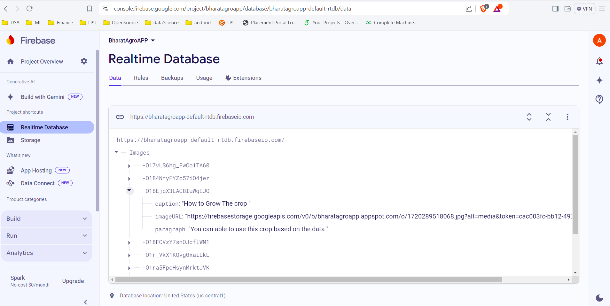
---
### Integrating Gemini API
- Integrate API: Obtain the Gemini API key, configure the backend for API requests, and update the admin interface to manage API settings.
- Enhance User Interface: Add a text input field and submit button for users to ask questions, then process and display real-time responses from the API.
- Ensure Functionality: Implement error handling and input validation, and conduct thorough testing to confirm smooth operation and user satisfaction.
---
## 📷 App Features

|  |  |  |
|:---:|:---:|:---:|
| App Image | Start Page | Login Page |

| 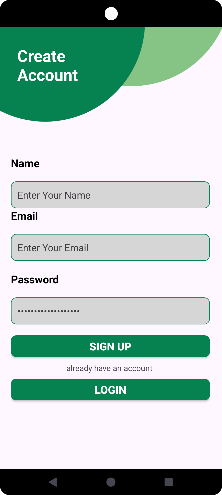 | 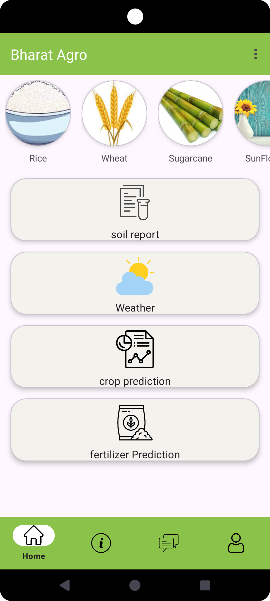 | 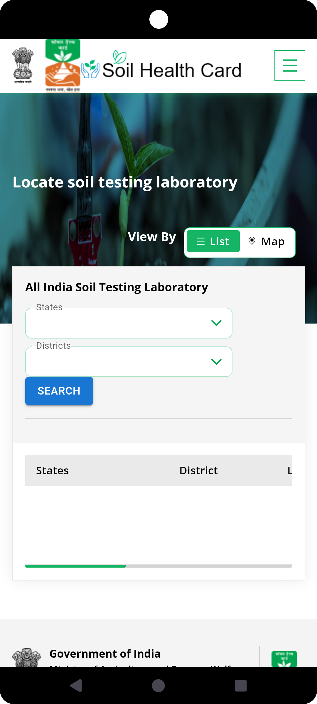 |
|:---:|:---:|:---:|
| Sign Up Page | Home Page | Soil Report |

|  | 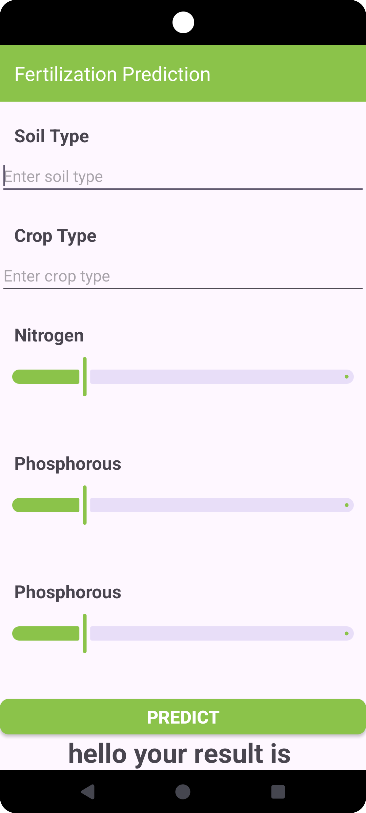 | 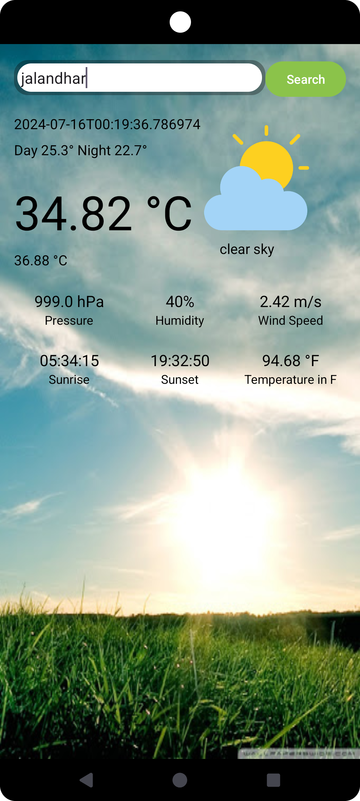 |
|:---:|:---:|:---:|
| Crop Prediction | Fertilization Prediction | Weather |

| 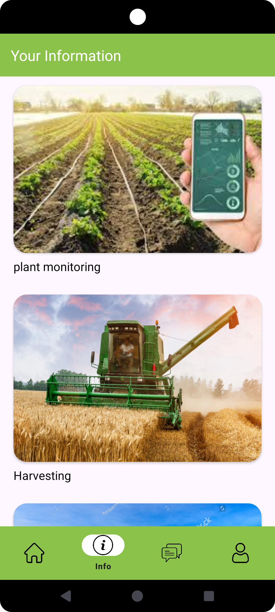 | 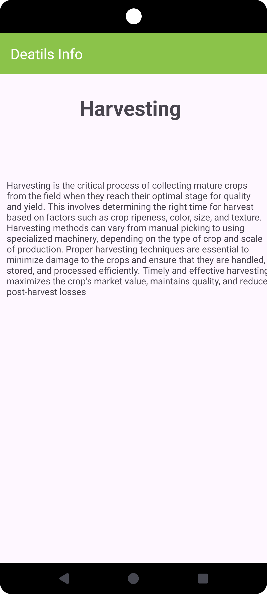 | 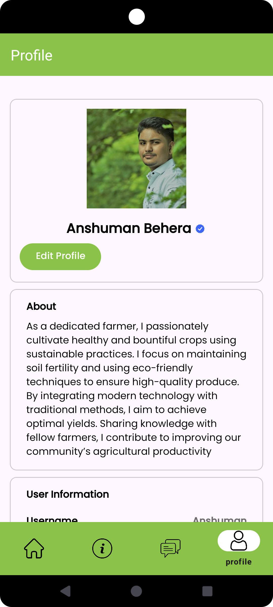 |
|:---:|:---:|:---:|
| Information Section | Information Details | Profile Section |

| 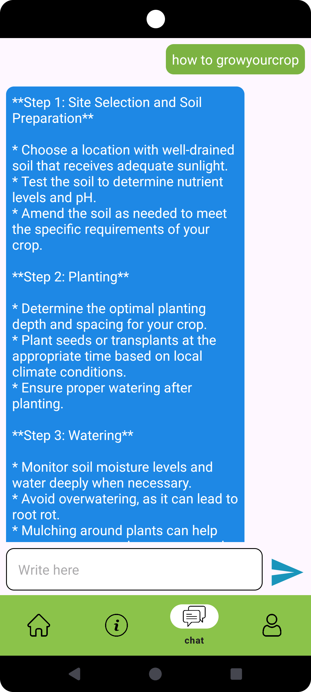 |     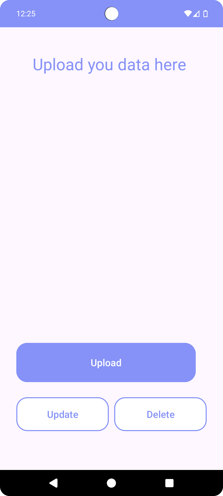     |     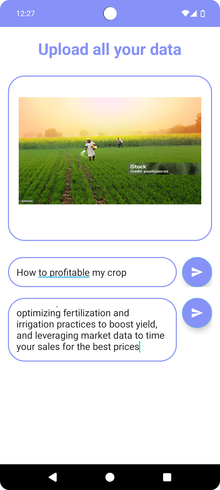     |
|:---:|:----------------------------------------------------------------------------:|:-------------------------------------------------------------------------:|
| Chartbot |                                AdminHomePage                                 |                                UploadData                                 |

